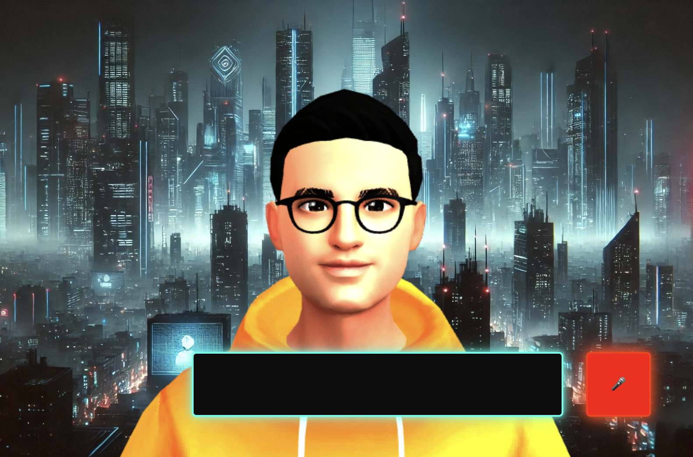

# avatar-ai

OpenAI Avatar for real-time api

It is demo project to show capabilities of RealTime api voice recognition and adopt web-sound api to process sound in
realtime to extract visemes from small sound buffers to syncronize voice with avatar lips.

## How to speak with AI?

Open the website https://chameleon82.github.io/avatar-ai/,
register new openAI token https://platform.openai.com/settings/organization/api-keys and enter there.

You MUST have positive balance on the openai account and give permissions to work with realtime-api.

Enjoy conversations with AI.

## Functionality

- Text and Voice recognition when speak to bot
- Bot will answer with voice in realtime
- Model will sync lips with the voice

